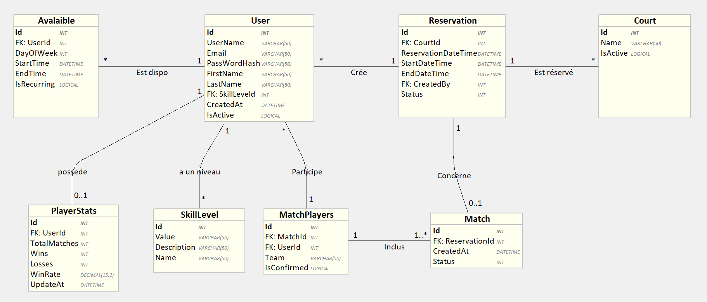
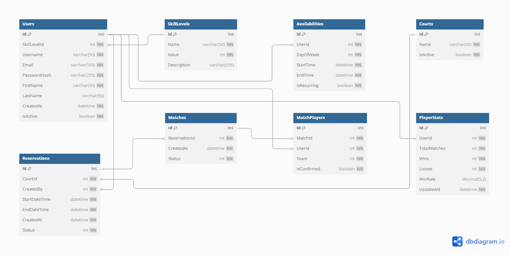

# Cahier des Charges - Projet de Formation

## 1. Présentation du projet
- **Titre du projet :**
  PadelMatch - Système de matchmaking pour joueurs de padel
- **Objectif principal du projet :**  
  Développer une API backend permettant de gérer les joueurs de padel, leurs disponibilités et de faciliter la recherche de partenaires compatibles selon leur niveau et leurs disponibilités.
- **Besoins et objectifs fonctionnels :**  
  - Gérer les profils des joueurs avec leurs niveaux de compétence
  - Enregistrer les disponibilités des joueurs
  - Permettre la recherche de partenaires selon des critères de compatibilité
  - Gérer les réservations de terrains
  <!-- - Notifier les joueurs lors de matchs potentiels -->

## Contexte
Le padel est un sport en pleine expansion qui se joue principalement en double. Les joueurs rencontrent souvent des difficultés pour trouver des partenaires de niveau similaire et disponibles aux mêmes horaires. Ce projet répond à ce besoin en proposant une plateforme de mise en relation intelligente, permettant d'optimiser l'utilisation des terrains et d'améliorer l'expérience des joueurs.

---

## Architecture du projet

### Type d'architecture choisie
- Architecture en couches 

- Justification :
  Cette architecture en couches permet de séparer clairement les responsabilités dans l'application, facilitant ainsi la maintenance et l'évolution du code. La séparation entre les couches de présentation, d'application, de domaine et d'infrastructure offre une meilleure organisation du code et permet d'implémenter efficacement les différents patterns de conception (Factory, Builder, CQS). Cette approche favorise également la testabilité des composants et permet d'isoler la logique métier des détails techniques d'implémentation, ce qui est particulièrement adapté à une application de gestion de réservations et de profils utilisateurs comme PadelMatch.
  
  L'architecture en couches comprendra :
  1. Couche Présentation (API Controllers)
  2. Couche Application (Services, Commands/Queries - CQS)
  3. Couche Domaine (Entités, Interfaces, Logic métier)
  4. Couche Infrastructure (Repositories, Implémentations externes)

  <!-- Les microservices incluront :
  1. Service de matchmaking (algorithme de recherche)
  2. Service de notifications -->

---

## Spécifications fonctionnelles

### Objectifs et Fonctionnalités
- Gestion des utilisateurs : Inscription, authentification, mise à jour de profil
- Gestion des niveaux de jeu : Définition et catégorisation des joueurs (débutant à expert)
- Système de disponibilités : Enregistrement des plages horaires des joueurs
- Recherche de partenaires : Recherche basée sur le niveau du joueur et ses disponibilités -->
- Réservation de terrains : Gestion des créneaux et des courts disponibles
- Historique de jeu : Suivi des matchs passés et statistiques basiques
<!-- - Système de notification : Alertes pour matchs potentiels et confirmations -->

### Liste des entités
- User : Représente un joueur avec ses informations personnelles et credentials
- SkillLevel : Catégorisation des niveaux de jeu (échelle de 1 à 5)
- Availability : Plages horaires de disponibilité d'un joueur
- Court : Terrain de padel disponible à la réservation
- Reservation : Créneau réservé sur un terrain spécifique
- Match : Rencontre entre joueurs avec résultat
- PlayerStats : Statistiques de chaque joueur
<!-- - MatchRequest : Demande de match entre joueurs
- Notification : Message système à destination d'un joueur --> 

---

## Spécifications techniques

### Technologies et Librairies
- ASP.NET Core 6+ : Framework moderne et performant pour l'API backend
- Entity Framework Core : ORM pour la gestion de la persistance des données
- SQL Server : Base de données relationnelle robuste
- Annotations de validation standard (.NET Core) : Pour la validation des entrées
- JWT pour l'authentification : Gestion sécurisée des tokens d'authentification
- Docker : Conteneurisation des services

### Tables et Structure de la Base de Données

| Nom Table | Champ | Type | Contrainte | Description |
|-----------|-------|------|------------|-------------|
| Users | Id | int | PK, AI | Identifiant unique |
|  | SkillLevelId | int | FK | Référence au niveau de jeu |
|  | Username | varchar(50) | NOT NULL, UNIQUE | Nom d'utilisateur |
|  | Email | varchar(100) | NOT NULL, UNIQUE | Email du joueur |
|  | PasswordHash | varchar(255) | NOT NULL | Hash du mot de passe |
|  | FirstName | varchar(50) | NOT NULL | Prénom |
|  | LastName | varchar(50) | NOT NULL | Nom de famille |
|  | CreatedAt | datetime | NOT NULL | Date de création |
|  | IsActive | bit | NOT NULL | Statut du compte |
| SkillLevels | Id | int | PK, AI | Identifiant unique |
|  | Name | varchar(50) | NOT NULL | Nom du niveau (Débutant, Intermédiaire...) |
|  | Value | int | NOT NULL | Valeur numérique (1-5) |
|  | Description | varchar(255) | NULL | Description du niveau |
| Availabilities | Id | int | PK, AI | Identifiant unique |
|  | UserId | int | FK | Référence à l'utilisateur |
|  | DayOfWeek | int | NOT NULL | Jour de la semaine (1-7) |
|  | StartTime | time | NOT NULL | Heure de début |
|  | EndTime | time | NOT NULL | Heure de fin |
|  | IsRecurring | bit | NOT NULL | Indique si récurrent |
| Courts | Id | int | PK, AI | Identifiant unique |
|  | Name | varchar(50) | NOT NULL | Nom du terrain |
|  | IsIndoor | bit | NOT NULL | Intérieur ou extérieur |
|  | IsActive | bit | NOT NULL | Disponible ou non |
| Reservations | Id | int | PK, AI | Identifiant unique |
|  | CourtId | int | FK | Référence au terrain |
|  | CreatedBy | int | FK | Utilisateur créateur |
|  | StartDateTime | datetime | NOT NULL | Heure de début |
|  | EndDateTime | datetime | NOT NULL | Heure de fin |
|  | CreatedAt | datetime | NOT NULL | Date de réservation |
|  | Status | int | NOT NULL | Statut (confirmé, annulé...) |
| Matches | Id | int | PK, AI | Identifiant unique |
|  | ReservationId | int | FK | Référence à la réservation |
|  | CreatedAt | datetime | NOT NULL | Date de création |
|  | Status | int | NOT NULL | Statut du match |
| MatchPlayers | Id | int | PK, AI | Identifiant unique |
|  | MatchId | int | FK | Référence au match |
|  | UserId | int | FK | Référence au joueur |
|  | Team | int | NOT NULL | Équipe (1 ou 2) |
|  | IsConfirmed | bit | NOT NULL | Confirmation de participation |
| PlayerStats | Id | int | PK, AI | Identifiant unique |
|  | UserId | int | FK, UNIQUE | Référence à l'utilisateur |
|  | TotalMatches | int | NOT NULL, DEFAULT 0 | Nombre total de matchs joués |
|  | Wins | int | NOT NULL, DEFAULT 0 | Nombre de victoires |
|  | Losses | int | NOT NULL, DEFAULT 0 | Nombre de défaites |
|  | WinRate | decimal(5,2) | NULL | Pourcentage de victoires |
|  | UpdatedAt | datetime | NOT NULL | Dernière mise à jour des stats |
<!-- | MatchRequests | Id | int | PK, AI | Identifiant unique |
|  | RequesterId | int | FK | Demandeur |
|  | ReceiverId | int | FK | Receveur |
|  | ProposedDate | date | NOT NULL | Date proposée |
|  | ProposedTime | time | NOT NULL | Heure proposée |
|  | Status | int | NOT NULL | Statut de la demande |
|  | CreatedAt | datetime | NOT NULL | Date de création |
| Notifications | Id | int | PK, AI | Identifiant unique |
|  | UserId | int | FK | Destinataire |
|  | Type | int | NOT NULL | Type de notification |
|  | Message | varchar(255) | NOT NULL | Contenu |
|  | IsRead | bit | NOT NULL | Lu ou non |
|  | CreatedAt | datetime | NOT NULL | Date de création | -->

### Procédures stockées
- `sp_FindCompatiblePlayers` : Trouve des joueurs compatibles selon niveau et disponibilités
- `sp_GetAvailableCourts` : Retourne les terrains disponibles à une date/heure donnée
- `sp_UpdatePlayerStats` : Met à jour les statistiques d'un joueur après un match
- `sp_GetMatchPartnersAndOpponents` : Récupère le partenaire et les adversaires d'un match

### Modélisation des données

#### Schéma Entité-Association (E-A)

#### Modèle Relationnel

---

## Planification prévisionnelle

| Étape | Description | Durée estimée |
|-------|-------------|---------------|
| 1 | Analyse et conception du schéma E-A | 1 jour |
| 2 | Création du projet et structure de base | 1 jour |
| 3 | Implémentation des entités et contexte EF | 1 jour |
| 4 | Développement des repositories et patterns | 2 jours |
| 5 | Implémentation de l'API pour utilisateurs et niveaux | 1 jour |
| 6 | Développement du système de disponibilités | 1 jour |
| 7 | Système de réservation et gestion des terrains | 1 jour |
| 8 | Tests unitaires et d'intégration | 1 jour |
| 9 | Dockerisation et configuration K8s | 1 jour |
| 10 | Documentation API et finalisation | 1 jour |
<!-- | 11 | Notifications et système de requêtes | 1 jour | -->
<!-- | 12 | Implémentation de l'algorithme de matchmaking | 2 jours | -->

---

## Gestion des risques

| Risque identifié | Probabilité | Impact | Solution envisagée |
|------------------|-------------|--------|--------------------|
| Performance avec de nombreux utilisateurs | Faible | Moyen | Indexation appropriée, pagination des résultats, mise en cache stratégique |
| Conflits de réservation | Élevée | Moyen | Implémentation de verrous optimistes, validations cohérentes |
| Sécurité des données utilisateurs | Moyenne | Élevé | Utilisation de JWT avec expiration, validation des entrées, hachage des mots de passe |
<!-- | Problèmes d'intégration des microservices | Moyenne | Moyen | Tests d'intégration, mocks pour les services externes, circuit breaker pattern | -->
<!-- | Complexité de l'algorithme de matchmaking | Moyenne | Élevé | Commencer par une version simple puis itérer, utiliser des tests unitaires extensifs | -->

---

## Critères d'acceptation et livraison

- API REST complète et documentée avec Swagger
- Architecture respectant les principes SOLID
- Implémentation correcte des patterns Factory, Builder et CQS
- Conteneurisation fonctionnelle avec Docker
<!-- - Démonstration de l'algorithme de matchmaking avec des cas d'utilisation réalistes -->

---

## Annexes

- Diagrammes de classes détaillés
- Exemples de requêtes API et réponses attendues
- Schéma d'architecture système
